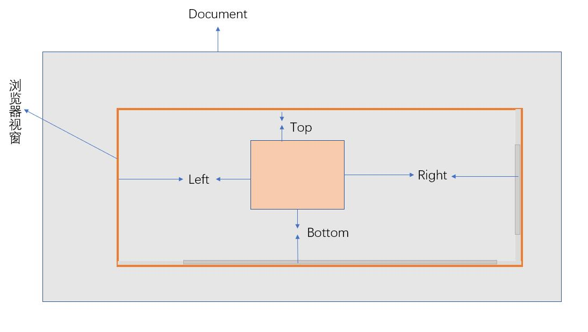
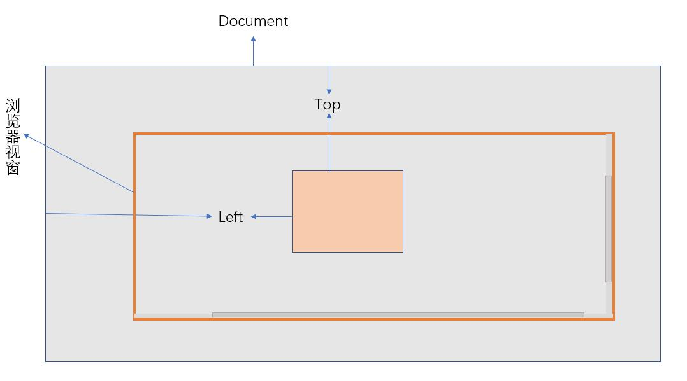
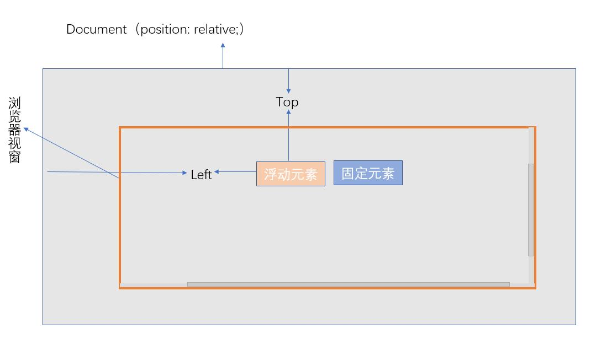

# document
DOM 操作

## createElement
创建一个新元素。

```js
import { createElement } from '@fatesigner/utils/document';

let ele = createElement('<ul><span>123</span></ul>');
console.log(ele);

// 输出: <ul><span>123</span></ul>
```

## removeElement
删除指定的元素。

```js
import { removeElement } from '@fatesigner/utils/document';

let ele = document.getElementById('ele');
removeElement(ele);
```

## prependChild
在指定元素的子元素之前再插入一个子元素。

```js
import { prependChild } from '@fatesigner/utils/document';

/**
 * @param {Node} childEl
 * @param {HTMLElement} parentEl
 */

let ele = createElement('<li><span>123</span></li>');
prependChild(ele, document.getElementById('ul'));
```

## isertBefore
在指定的元素前面追加新元素。

```js
import { isertBefore } from '@fatesigner/utils/document';

/**
 * @param {HTMLElement} newEl
 * @param {HTMLElement} targetEl
 */

let ele = createElement('<li><span>123</span></li>');
isertBefore(ele, document.getElementById('li'));
```

## insertAfter
在指定的元素后面追加新元素。

```js
import { insertAfter } from '@fatesigner/utils/document';

/**
 * @param {HTMLElement} newEl
 * @param {HTMLElement} targetEl
 */

let ele = createElement('<li><span>123</span></li>');
insertAfter(ele, document.getElementById('li'));
```

## matchesSelector
判断元素是否匹配指定的选择器。

```js
import { matchesSelector } from '@fatesigner/utils/document';

/**
 * @param element 待检测元素
 * @param selector 选择器
 */

let ele = matchesSelector('<li><span>123</span></li>');

console.log(matchesSelector(ele, 'li'));

// 输出: true
```

## closest
获得匹配选择器的第一个祖先元素，从当前元素开始沿 DOM 树向上。

```js
import { closest } from '@fatesigner/utils/document';

/**
 * @param {HTMLElement} el 当前元素
 * @param {string} selector 要获取的祖先元素的选择器
 * @param {boolean} containsItsOwn 是否检查匹配当前元素
 */

let ele = matchesSelector('<li><span>123</span></li>');

console.log(closest(ele, 'ul'));

// 输出: <ul></ul>
```

## contains
获得匹配选择器的第一个祖先元素，从当前元素开始沿 DOM 树向上。

```js
import { contains } from '@fatesigner/utils/document';

/**
 * @param {HTMLElement} el 当前元素
 * @param {string} selector 要获取的祖先元素的选择器
 * @param {boolean} containsItsOwn 是否检查匹配当前元素
 */

console.log(contains(document.getElementById('ul'), document.getElementById('li')));

// 输出: true
```

## hasClass
判断指定元素是否包含某个class。

```js
import { hasClass } from '@fatesigner/utils/document';

/**
 * @param {HTMLElement} element
 * @param {string} className
 * @returns {boolean}
 */

console.log(hasClass(document.getElementById('ul'), 'ul-warp'));

// 输出: true
```

## addClass
为元素添加class。

```js
import { addClass } from '@fatesigner/utils/document';

/**
 * @param {HTMLElement} element
 * @param {string} className
 * @returns {boolean}
 */

addClass(document.getElementById('ul'), 'ul-warp')
```

## removeClass
为元素移除class。

```js
import { removeClass } from '@fatesigner/utils/document';

/**
 * @param {HTMLElement} element
 * @param {string} className
 * @returns {boolean}
 */

addClass(document.getElementById('ul'), 'ul-warp')
```

## getViewportSize
获取浏览器窗口的可视区域尺寸。

```js
import { getViewportSize } from '@fatesigner/utils/document';

/**
 * @param {HTMLDocument} dom
 * @returns {number} 宽度
 */

console.log(getViewportSize());

// 输出: {width: 1360, height: 731}
```

## getBoundingClientRect
获取指定元素的边界（上、下、左、右）分别相对浏览器视窗边界的位置。
这与原生 [getBoundingClientRect](https://developer.mozilla.org/zh-CN/docs/Web/API/Element/getBoundingClientRect) 不同，bottom和right是相对于视窗底部和右端的距离，若该元素超出视窗，则该值为负数。



```js
import { getBoundingClientRect } from '@fatesigner/utils/document';

/**
 * @param {Element} element
 * @returns {Object} top,lef,right,bottom,width,height
 * top：元素上边界距窗口最上面的距离
 * right：元素右边界距窗口最左边的距离
 * bottom：元素下边界距窗口最上面的距离
 * left：元素左边界距窗口最左边的距离
 * width：元素宽度
 * height：元素高度
 */

console.log(getBoundingClientRect(document.getElementById('ul')));

// 输出: 
{
  width: 100,
  height: 100,
  top: 400,
  right: 1320,
  bottom: 580,
  left: 500
}
```

## getOffsetAwayFromDocument
获取元素在相对于文档滚动的偏移量。



```js
import { getOffsetAwayFromDocument } from '@fatesigner/utils/document';

/**
 * @param {Element} element 元素
 * @returns {Object} position
 */

console.log(getOffsetAwayFromDocument(document.getElementById('ul')));

// 输出: 
{
  top: 660,
  left: 500
}
```

## getAbsRelativeLayout
获取需要绝对定位的元素相对于目标元素的定位布局 居（上、右、下、左），可用于点击某个按钮显示一个tip。
- 该函数会默认找到一个能让绝对定位元素完整地显示在视窗之内而不被遮挡的位置，你也可以设置一个期望让该绝对定位元素停靠在固定元素的位置（靠左或是靠右）
- 返回 { top, right, bottom, left }，可以将其设置给绝对定位元素。


```js
import { getAbsRelativeLayout } from '@fatesigner/utils/document';

/**
 * 设置贴近目标元素最近，能完整显示浮动元素的一个位置
 * 用于为浮动元素定位在目标元素身边
 * @param {HTMLElement} targetEl 目标元素
 * @param {HTMLElement} absEl 浮动元素
 * @param {string} direction 期望相对于目标元素的方向 默认为 down
 * top、right、bottom、left
 * @returns {Object}
 * direction：up、down、right、left
 */

console.log(getOffsetAwayFromDocument(document.getElementById('ul')));

// 输出: 
{
  top: 660,
  right: 1020,
  bottom: 500,
  left: 500
}
```

## getScrollLeft
获取浏览器窗口水平滚动条的位置。

```js
import { getScrollLeft } from '@fatesigner/utils/document';

/**
 * @param {Document} dom document
 * @returns {number} left
 */

console.log(getScrollLeft(document));

// 输出: 360
```

## getScrollTop
获取浏览器窗口垂直滚动条的位置。

```js
import { getScrollTop } from '@fatesigner/utils/document';

/**
 * @param {Document} dom document
 * @returns {number} top
 */

console.log(getScrollTop(document));

// 输出: 760
```

## scrollYTo
将容器滚动到指定位置。

```js
import { scrollYTo } from '@fatesigner/utils/document';

/**
 * @param container 容器元素
 * @param distance 滚动距离
 * @param duration 间隔时间，默认为 0，即无动画效果
 * @returns {Promise}
 */

scrollYTo(document.getElementById('ul'));
```

## scrollToTop
将容器滚动到顶部。

```js
import { scrollToTop } from '@fatesigner/utils/document';

/**
 * @param container 容器元素
 * @param duration 间隔时间，默认为 0，即无动画效果
 * @returns {Promise}
 */

scrollToTop(document.getElementById('ul'));
```

## scrollToBottom
将容器滚动到底部。

```js
import { scrollToBottom } from '@fatesigner/utils/document';

/**
 * @param container 容器元素
 * @param duration 间隔时间，默认为 0，即无动画效果
 * @returns {Promise}
 */

scrollToBottom(document.getElementById('ul'));
```

## addToCollectionSites
将指定的链接和标题加入到收藏夹。

```js
import { addToCollectionSites } from '@fatesigner/utils/document';

/**
 * @param {string} url 链接
 * @param {string} title 标题
 */

addToCollectionSites({ url: 'http://localhost:3000/location/', 'title' });
```

## openNewWindow
模拟a标签打开新窗口，避免被浏览器阻止。

```js
import { openNewWindow } from '@fatesigner/utils/document';

/**
 * @param {string} link 链接
 */

openNewWindow('http://localhost:3000/location/');
```

## loadScript
加载指定的远程脚本，新建 script 标签并添加至 head 返回 Promise。

```js
import { loadScript } from '@fatesigner/utils/document';

/**
 * @param {string} link 链接
 */

loadScript('http://localhost:3000/location/ss.js');
```

## getFiles
获取 input 元素的文件集合。

```js
import { getFiles } from '@fatesigner/utils/document';

/**
 * @param input 
 */

let files = getFiles(document.getElementById('input'));

console.log(files);

// 输出：[]
```

## getFileName
获取 File 对象的文件名。

```js
import { getFileName, getFiles } from '@fatesigner/utils/document';

/**
 * @param {File} file 对象 
 * @return {string} filename
 */

let filename = getFileName(getFiles(document.getElementById('input'))[0]);

console.log(filename);

// 输出：image.jpg
```

## getFileNameWithoutExtention
获取 File 对象的文件名，不包含拓展名。

```js
import { getFileNameWithoutExtention, getFiles } from '@fatesigner/utils/document';

/**
 * @param {File} file 对象 
 * @return {string} filename
 */

let filename = getFileNameWithoutExtention(getFiles(document.getElementById('input'))[0]);

console.log(filename);

// 输出：image
```

## getExtension
获取 File 对象的后缀名。

```js
import { getExtension, getFiles } from '@fatesigner/utils/document';

/**
 * @param {File} file 对象 
 * @return {string} extname
 */

let ext = getExtension(getFiles(document.getElementById('input'))[0]);

console.log(ext);

// 输出：.jpg
```

## isImage
判断 File 对象是否为图片类型。

```js
import { isImage, getFiles } from '@fatesigner/utils/document';

/**
 * @param {File} file 对象 
 * @return {boolean} 
 */

console.log(isImage(getFiles(document.getElementById('input'))[0]));

// 输出：true
```

## getImageSize
判断 File 对象是否为图片类型。

```js
import { getImageSize, getFiles } from '@fatesigner/utils/document';

/**
 * @param {File} file 对象 
 * @return {boolean} 
 */

let file = getFiles(document.getElementById('input')[0]);

getImageSize(file).then(function (res){
  console.log(res);
});

// 输出：{width:100,heigh:120}
```

## loadImage
加载指定图片，获取图片信息。

```js
import { loadImage, getFiles } from '@fatesigner/utils/document';

/**
 * @param {string} url 图片地址
 * @return {Promise} 
 */

loadImage('localhost:3000/image.jpg')(file).then(function (res){
  console.log(res);
});

// 输出：{width:100,heigh:120}
```

## filterExtensions
判断 file 对象类型是否符合指定的一些拓展名类型，用于图片类型过滤。

```js
import { filterExtensions, getFiles } from '@fatesigner/utils/document';

/**
 * @param {File} file
 * @param {string} extensions 后缀名集合，用逗号隔开，如['.jpeg','png']
 * @returns {boolean}
 */

let file = getFiles(document.getElementById('input')[0]);

console.log(filterExtensions(file, ['.jpeg','png']));

// 输出：true
```

## getImageSrc
给定 file 对象，返回图片的资源地址，用于选择图片后的预览。

```js
import { getImageSrc, getFiles } from '@fatesigner/utils/document';

/**
 * @param {File | string} file
 * @returns {Promise<string>}
 */

let file = getFiles(document.getElementById('input')[0]);

getImageSrc(file).then(function (res){
  console.log(res);
});

// 输出：’data:image/png;base64...‘
```

## clearInputFile
重置指定的 input 元素，将其选择的文件置空。

```js
import { clearInputFile } from '@fatesigner/utils/document';

/**
 * @param input
 */

clearInputFile(document.getElementById('input'));
```

## addEventPrefix
为指定的事件名称添加当前浏览器支持的前缀。

```js
import { addEventPrefix } from '@fatesigner/utils/document';

/**
 * @param {String} eventName
 * @return {String} eventName has prefix
 */

console.log(addEventPrefix('mouseenter'));

// 输出：mouseenter
```

## addEventListener
为元素绑定指定事件，基于原生的 element.addEventListener。

```js
import { addEventListener } from '@fatesigner/utils/document';

/**
 * @param {Object} element 需要绑定的元素
 * @param {string} type 需要代理的事件 一个或多个用空格分隔的事件类型
 * @param {Function} handler 事件触发的回调
 * @param {Boolean} [useCapture=false] 默认为 false
 * true：Capture 方式
 * false：Bubbling 方式
 * PS:该值建议设置为 false
 */

const handler = function() {
  console.log('input onchange');
};

addEventListener(document.getElementById('input'), 'change', handler);
```

## removeEventListener
为元素移除指定的事件，基于原生的 element.removeEventListener。

```js
import { removeEventListener } from '@fatesigner/utils/document';

/**
 * @param {Object} element 需要绑定的元素
 * @param {Object} type 需要代理的事件 一个或多个用空格分隔的事件类型
 * @param {Function} handler 事件触发的回调
 */

const handler = function() {
  console.log('input onchange');
};

addEventListener(document.getElementById('input'), 'change', handler);

removeEventListener(document.getElementById('input'), 'change', handler);
```

## on
为指定的选择器绑定事件（代理模式）。

```js
import { on } from '@fatesigner/utils/document';

/**
 * PS：弃用一些不支持冒泡事件的类型 如：focus、transition...
 * @param {Object} elements 需要绑定的元素
 * @param {Object} types 需要代理的事件 一个或多个用空格分隔的事件类型
 * @param {Object} selector 需要代理的节点 一个选择器字符串用于过滤器的触发事件的选择器元素的后代
 * @param {Function} handlerForMatched 匹配的节点触发 回调
 * @param {Function} [handlerForAll=null] 绑定的元素内所有的节点触发 回调
 * @param {Boolean} [one=false] 事件是否只触发一次 触发完成后 清除代理
 * @return {Function} 执行后 清除代理
 */

const handler = function() {
  console.log('li click');
};

on(document.getElementById('ul'), 'click', 'li', handler);
```

## one
为指定的选择器绑定事件（代理模式），只触发一次，触发完成会移除该事件。

```js
import { one } from '@fatesigner/utils/document';

/**
 * PS：弃用一些不支持冒泡事件的类型 如：focus、transition...
 * @param {Object} elements 需要绑定的元素
 * @param {Object} types 需要代理的事件 一个或多个用空格分隔的事件类型
 * @param {Object} selector 需要代理的节点 一个选择器字符串用于过滤器的触发事件的选择器元素的后代
 * @param {Function} handlerForMatched 匹配的节点触发 回调
 * @param {Function} handlerForAll 绑定的元素内所有的节点触发 回调
 * @return {Function} 执行后 清除代理
 */

const handler = function() {
  console.log('li click');
};

one(document.getElementById('ul'), 'click', 'li', handler);
```

## hover
为指定的选择器绑定 hover 事件（代理模式）。

```js
import { hover } from '@fatesigner/utils/document';

/**
 * @param {Object} elements 需要绑定的元素
 * @param {Object} selector 需要代理的节点 一个选择器字符串用于过滤器的触发事件的选择器元素的后代
 * @param {Function} handlerIn in 鼠标移入事件
 * @param {Function} handlerOut out 鼠标移出事件
 * @return {Function} 执行后 清除代理
 */

const handler = function() {
  console.log('input onchange');
};

hover(document.getElementById('ul'), 'li', function() {
  console.log('handlerIn');
}, function() {
  console.log('handlerOut');
});
```

## onTransitionEnd
为指定的元素绑定 TransitionEnd 事件。

```js
import { onTransitionEnd } from '@fatesigner/utils/document';

/**
 * @param el
 * @param fun 
 */

const handler = function() {
  console.log('ul transition end');
};

onTransitionEnd(document.getElementById('ul'), handler);
```
